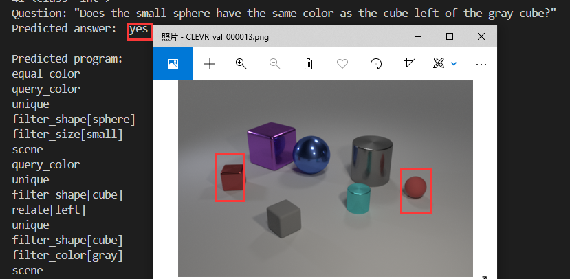

# for torcg=1.7版本
## 当我2021-11-01想run起：https://github.com/facebookresearch/clevr-iep/
但是由于torch版本变迁，然而我使用的3090必须得cuda11以上版本

so，我更新了一些代码，现在他可以运行在torch1.7上了


查看cuda版本
```bash
cat /usr/local/cuda/version.txt
cat /usr/local/cuda-11/version.json
   "cuda" : {
      "name" : "CUDA SDK",
      "version" : "11.4.1"
pytorch，torchvision 版本：进入python
>>> import torch
>>> torch.__version__
'1.7.0+cu110'
>>> import torchvision
>>> print(torchvision.__version__)
0.8.0

如果使用高版本的torch直接运行，则会出现以下报错
models/seq2seq.py", line 57, in get_dims
    T_out = y.size(1) if y is not None else None
IndexError: Dimension out of range (expected to be in range of [-1, 0], but got 1)
```

这里的根本原因是此代码是使用非常旧版本的 PyTorch 编写的，并且从那时起对 PyTorch 进行了大量重大更改，这意味着代码中很多tensor的size和type在最近的 PyTorch 版本中不存在。
----------------以下为原文---向原作者致敬-----------------

# inferring-and-executing

This is the code for the paper

 **<a href="https://arxiv.org/abs/1705.03633">Inferring and Executing Programs for Visual Reasoning</a>**
 <br>
 <a href='http://cs.stanford.edu/people/jcjohns/'>Justin Johnson</a>,
 <a href='http://home.bharathh.info/'>Bharath Hariharan</a>,
 <a href='https://lvdmaaten.github.io/'>Laurens van der Maaten</a>,
 <a href='http://cs.stanford.edu/~jhoffman/'>Judy Hoffman</a>,
 <a href='http://vision.stanford.edu/feifeili/'>Fei-Fei Li</a>,
 <a href='http://larryzitnick.org/'>Larry Zitnick</a>,
 <a href='http://www.rossgirshick.info/'>Ross Girshick</a>
 <br>
 To appear at [ICCV 2017](http://iccv2017.thecvf.com/)

<div align="center">
  
</div>

If you find this code useful in your research then please cite

```
@inproceedings{johnson2017inferring,
  title={Inferring and Executing Programs for Visual Reasoning},
  author={Johnson, Justin and Hariharan, Bharath and van der Maaten, Laurens and Hoffman, Judy
          and Fei-Fei, Li and Zitnick, C Lawrence and Girshick, Ross},
  booktitle={ICCV},
  year={2017}
}
```

# Setup

All code was developed and tested on Ubuntu 16.04 with Python 3.5.

You can set up a virtual environment to run the code like this:

```bash
virtualenv -p python3 .env       # Create virtual environment
source .env/bin/activate         # Activate virtual environment
pip install -r requirements.txt  # Install dependencies
echo $PWD > .env/lib/python3.5/site-packages/iep.pth # Add this package to virtual environment
# Work for a while ...
deactivate # Exit virtual environment
```

# Pretrained Models
You can download and unzip the pretrained models by running `bash scripts/download_pretrained_models.sh`;
the models will take about 1.1 GB on disk.

We provide two sets of pretrained models:
- The models in `models/CLEVR` were trained on the CLEVR dataset; these were used to make Table 1 in the paper.
- The models in `models/CLEVR-Humans` were first trained on CLEVR and then finetuned on the CLEVR-Humans dataset;
   these models were used to make Table 3 in the paper.

# Running models

You can easily run any of the pretrained models on new images and questions. As an example, we will run several
models on the following example image from the CLEVR validation set:

<div align='center'>
 
</div>

After downloading the pretrained models, you can use the pretrained model to answer questions about this image with
the following command:

```bash
python scripts/run_model.py \
  --program_generator models/CLEVR/program_generator_18k.pt \
  --execution_engine models/CLEVR/execution_engine_18k.pt \
  --image img/CLEVR_val_000013.png \
  --question "Does the small sphere have the same color as the cube left of the gray cube?"
```

This will print the predicted answer, as well as the program that the model used to produce the answer.
For the example command we get the output:

```bash
Question: "Does the small sphere have the same color as the cube left of the gray cube?"
Predicted answer:  yes

Predicted program:
equal_color
query_color
unique
filter_shape[sphere]
filter_size[small]
scene
query_color
unique
filter_shape[cube]
relate[left]
unique
filter_shape[cube]
filter_color[gray]
scene
```

# Training

The procedure for training your own models [is described here](TRAINING.md).
